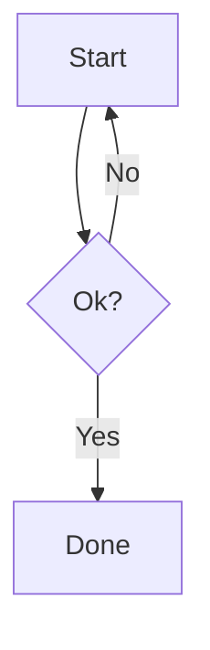

# MD2PDF

Convert **Markdown** (and **HTML**) files to clean, print-ready **PDF** — with
**Mermaid diagrams rendered**, an optional table of contents, and a title /
author / date header. Works fully **offline**, from a command line or from a
small **drag-and-drop Windows app**.

## Features

- Markdown → PDF with GitHub-style formatting (tables, code highlighting, quotes)
- ` ```mermaid ` blocks are rendered as vector diagrams (no blank pages, always fit on one page)
- **HTML → PDF** (`.html` / `.htm`) with the same header/footer options
- Title block (title · author · date · version), optional **clickable table of contents**
- Running header and `Page X of Y` footer (can be switched off)
- **Drag & drop GUI**: drop files or whole folders, choose an output folder, batch convert
- Built-in **reader**: double-click a file to preview it rendered in your browser
- Single-file `MD2PDF.exe` build — uses the Edge / Chrome already installed, mermaid.js is bundled

## Quick start

### Command line

```bash
pip install markdown pygments playwright
# Only needed if Microsoft Edge / Google Chrome is not installed:
playwright install chromium

python md2pdf.py report.md
python md2pdf.py report.md -o out.pdf --author "Jane Doe" --version v1.0 --toc
python md2pdf.py page.html          # HTML -> PDF
```

### GUI

```bash
pip install tkinterdnd2
python md2pdf_gui.py
```

Drop `.md` / `.html` files or folders onto the window, optionally pick an output
folder, then press **Convert all to PDF**. Double-click a file to preview it.

### Windows exe

Put `md2pdf.py`, `md2pdf_gui.py` and `build_exe.bat` in one folder and run
`build_exe.bat`. The result is `dist\MD2PDF.exe` (roughly 60–100 MB; most of it is
Playwright's driver). The exe needs **Microsoft Edge or Chrome** on the PC and no internet.

## Command-line options

| Option | Description |
| --- | --- |
| `input` | `.md`, `.markdown`, `.html` or `.htm` file |
| `-o`, `--output` | Output PDF path (default: next to the input) |
| `--title` | Title (default: front matter → first `# Heading` → `<title>` for HTML) |
| `--author`, `--version` | Shown in the title block and running header |
| `--date` | Default: today (`YYYY-MM-DD`) |
| `--toc`, `--toc-depth N`, `--toc-title` | Table of contents (Markdown only); depth default 3 |
| `--no-header-footer` | Remove running header and page numbers |
| `--mermaid-js PATH` | Use a local `mermaid.min.js` instead of the CDN (offline) |

### Front matter

Put this at the top of a Markdown file. Command-line flags override it.

```yaml
---
title: Assembly position writer
author: Jane Doe
date: 2026-10-02
version: v1.0
toc: true
toc_depth: 3
---
```

### Mermaid

````markdown

````

The CLI loads mermaid.js from a CDN unless you pass `--mermaid-js`. The exe
always uses its bundled copy. To get a local copy:
`curl -L -o mermaid.min.js https://cdn.jsdelivr.net/npm/mermaid@11/dist/mermaid.min.js`

## Project layout

```
.
├── md2pdf.py          # core + command-line tool
├── md2pdf_gui.py      # drag & drop app (tkinter)
├── build_exe.bat      # builds dist\MD2PDF.exe with PyInstaller
├── requirements.txt
├── README.md
└── docs/
    └── md2pdf.md      # why / what / how, flow diagram, configuration
```

## How it works

Markdown is converted to HTML (python-markdown), Mermaid fences are protected during
conversion and rendered by mermaid.js inside a headless Edge / Chrome (driven by
Playwright), and the page is printed to PDF with optional header and footer. HTML
inputs skip the conversion and are printed as-is. See [docs/md2pdf.md](docs/md2pdf.md)
for the full flow and configuration.

## Troubleshooting

| Problem | Fix |
| --- | --- |
| "Could not start browser" | Install Microsoft Edge or Chrome, or run `playwright install chromium` |
| Diagram shows as text | Mermaid syntax error — the browser error is printed in the console / GUI log |
| Diagrams missing when offline (CLI) | Pass `--mermaid-js ./mermaid.min.js` |
| Images missing | Use paths relative to the `.md` file (or absolute `file:` / `https:` URLs) |
| Antivirus flags the exe | Common with PyInstaller one-file builds; build it yourself or whitelist it |
| TOC has no page numbers | Not supported — the TOC entries are clickable links instead |
| HTML page prints differently from the screen | The page's own `@media print` CSS is used |

## Limitations

- The TOC is a list of links, not a page-numbered index.
- Header/footer text is simple (title, author, version, date, page numbers).
- The GUI exe build script targets Windows.

## License

Add a `LICENSE` file of your choice before publishing.
