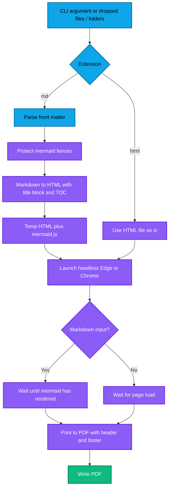

# MD2PDF

**CLI:** `md2pdf.py` · **GUI:** `md2pdf_gui.py` · **Exe build:** `build_exe.bat`

## Why

Technical write-ups live as Markdown (with Mermaid diagrams) in repositories, but
reviews, customers and archives need a PDF. Doing that by hand means exporting
diagrams as images, fixing page breaks and re-typing headers — slow, and different
every time. Existing tools often need a LaTeX or Node toolchain, which is heavy on
locked-down engineering PCs.

## What

A small tool that turns Markdown or HTML files into PDFs with Mermaid diagrams
rendered, a title / author / date block, an optional table of contents, and a running
header with page numbers. It runs offline, as a script or as a single drag-and-drop
exe that reuses the Microsoft Edge / Chrome already on the machine.

## How

### Detailed flow

**Talk track:** Mermaid fences are swapped for placeholders before the Markdown
parser runs, so diagrams are never mangled. The browser renders them, and the PDF is
only printed after a `mermaidDone` flag is set, so diagrams are never half-drawn.
Diagrams are height-capped so a tall flowchart always fits on one page.

### User guide

1. **Command line:** `python md2pdf.py report.md --author "Jane Doe" --toc`.
2. **HTML input:** `python md2pdf.py page.html` — prints the HTML as-is, with the
   same header / footer options.
3. **GUI:** run `md2pdf_gui.py` (or `MD2PDF.exe`), drop `.md` / `.html` files or
   folders on the window, choose an output folder (empty = next to each file), set
   author / version / TOC / header options and press **Convert all to PDF**.
4. **Reader:** double-click a list entry (or **Preview selected**) to read the
   rendered document in your browser.
5. **Folders:** dropping a folder adds every `.md` below it. Tick *Include .html when
   adding folders* to also add `.html` files. Files dropped individually are always accepted.
6. **Exe:** run `build_exe.bat`; the result is `dist\MD2PDF.exe`.

### Configuration

Command-line options (the GUI exposes the same settings as fields and checkboxes):

| Option | Default | Description |
| --- | --- | --- |
| `input` | required | `.md`, `.markdown`, `.html` or `.htm` file. |
| `-o` / `--output` | input name + `.pdf` | Output PDF path. |
| `--title` | front matter, first `# Heading`, `<title>` | Document title. |
| `--author` / `--version` | empty | Title block and running header. |
| `--date` | today | Title block and footer. |
| `--toc` / `--toc-depth` / `--toc-title` | off / `3` / `Contents` | Table of contents (Markdown only). |
| `--no-header-footer` | off | Removes running header and page numbers. |
| `--mermaid-js` | CDN | Local `mermaid.min.js` for offline use. |

Front matter keys (Markdown only; flags override them): `title`, `author`, `date`,
`version`, `toc`, `toc_depth`.

### Outputs

One PDF per input file (A4, 16 mm side margins). In the GUI, if two inputs would
produce the same name (for example `a.md` and `a.html`, or the same name in two
folders), the later one gets a numeric suffix such as `a_1.pdf`. The GUI log shows
✔ / ✘ per file and a final count.

## What is next

- Page-numbered table of contents (two-pass render).
- Custom CSS / theme option, and dark-diagram theme.
- Command-line batch mode (folders and globs).
- Optional "also save the rendered HTML" output.
- macOS / Linux packaging of the GUI.
